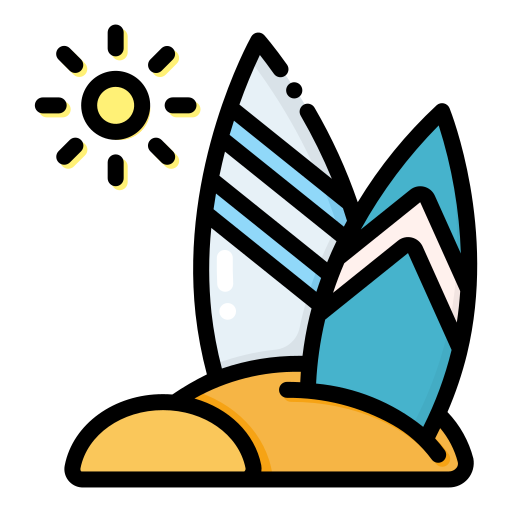

# The Surfing Project by THP

<!-- PROJECT LOGO -->
 

  

<!--About the project-->

## About The Project

Create the same homepage to this website using Boostrap: 
https://imgur.com/zZzjc3t

----

Built With:

<!-- MARKDOWN LINKS & IMAGES -->

---

<!-- GETTING STARTED -->
## Project Link
https://camillelenormand.github.io/surfing-project/

 
